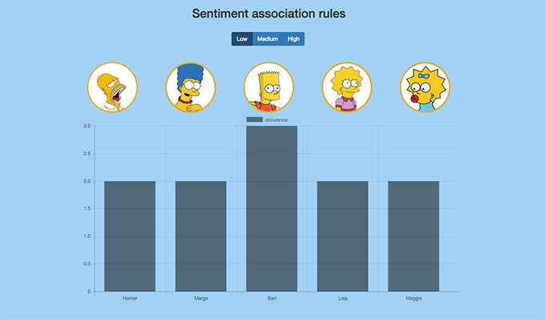

# MI-DDW homework #2
Association rules mining of The Simpsons episodes  
Live demo: http://pchmelar.cz/ddw

## How it works

- take dataset from a previous homework - [Sentiment analyzer of The Simpsons episodes](https://github.com/pchmelar/ddw-homework1)
- extend the dataset by occurrence of main characters in the episodes
- perform association rules mining using RapidMiner
- display the results as graphs using chart.js

## Description of graphs

There are three graphs for every character. They differ in the occurrence of that character in the episodes (low/medium/high). Graphs shows occurrence of other characters in those episodes (0 for none, 1 for low, 2 for medium, 3 for high). Furthermore, there are three more graphs which shows occurrence of characters in episodes with low/medium/high sentiment level.

## Screenshots

## Conclusion

- higher occurrence of Bart in the episodes with low level of sentiment (those episodes are probably more violent/vulgar)
- higher occurrence of Homer and Marge in the episodes with high level of sentiment (more romantic)

